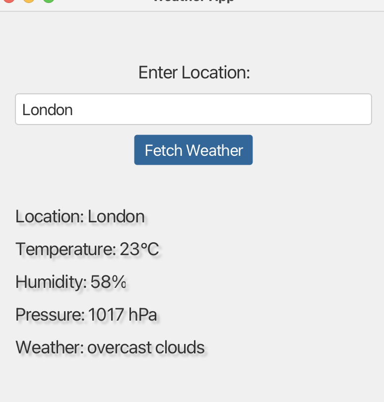

# JavaFX Weather App



## Table of Contents

- [Description](#description)
- [Features](#features)
- [Installation](#installation)
- [Usage](#usage)
- [Contributing](#contributing)
- [License](#license)

## Description

The JavaFX Weather App is a desktop application that allows users to retrieve weather information based on location.
This README provides an overview of the app's features, installation instructions, and usage guidelines.

## Features

- Retrieve weather information for a specific location.
- Display temperature, weather condition, humidity, and wind speed.
- User-friendly graphical interface built with JavaFX.
- Supports various desktop platforms (Windows, macOS, Linux).

## Installation

### Prerequisites

- Java Development Kit (JDK) 11 or later.
- Git (optional for cloning the repository).

### Download

You can download the latest release of the app from the [Releases](https://github.com/CodaBlurd/WeatherApp.git) page.

### Build from Source

To build the app from source, follow these steps:

1. Clone this repository:

   ```bash
   git clone https://github.com/CodaBlurd/WeatherApp.git

### License

This project is licensed under the MIT License. See the LICENSE file for details.
